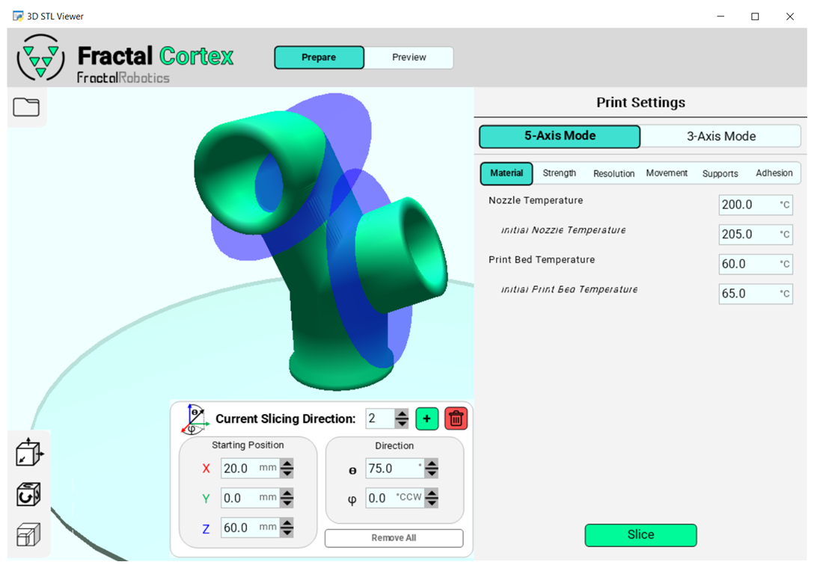
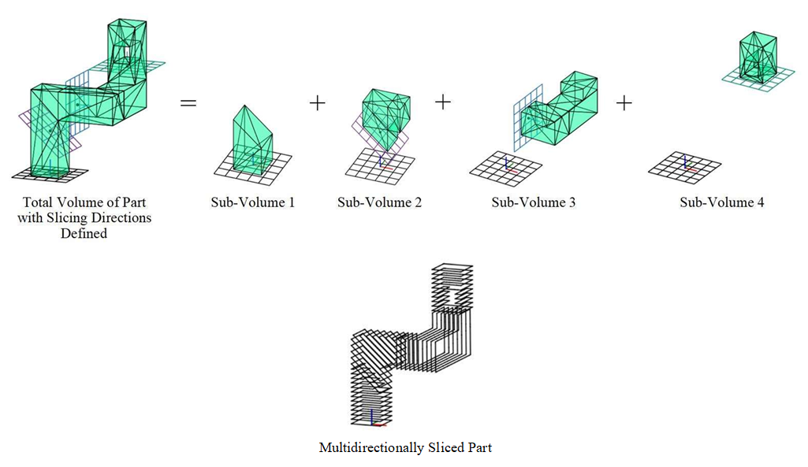
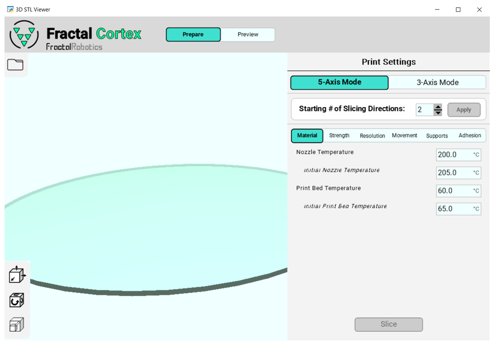
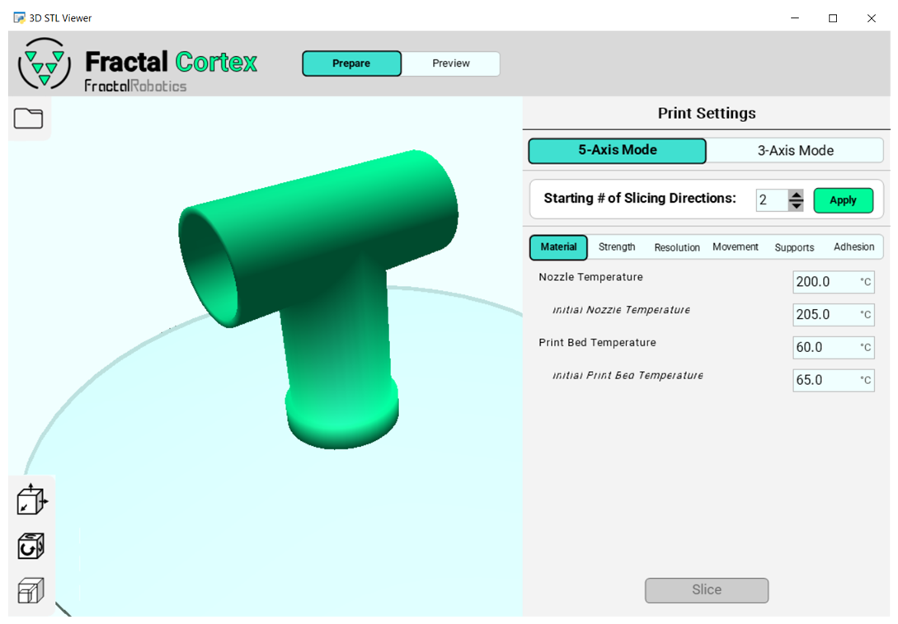
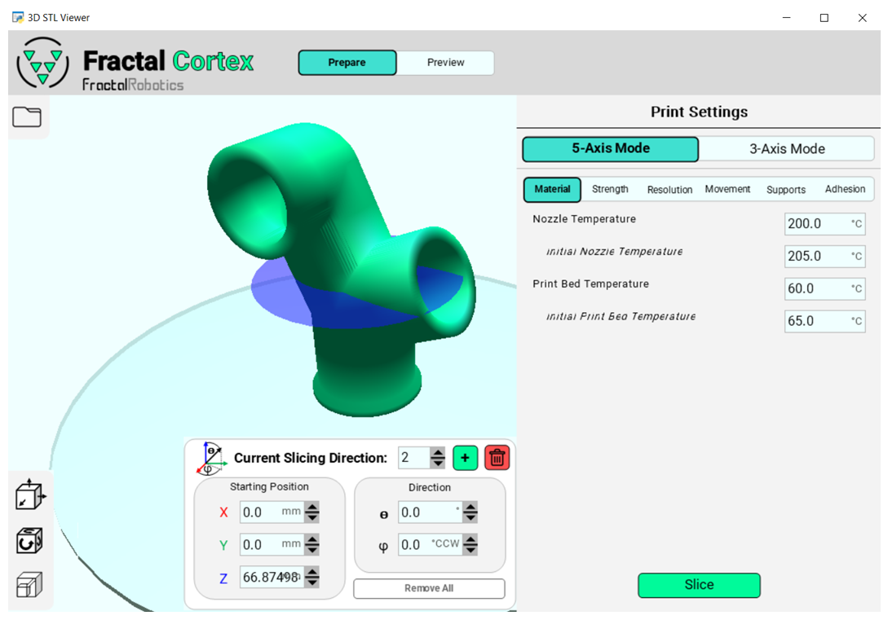
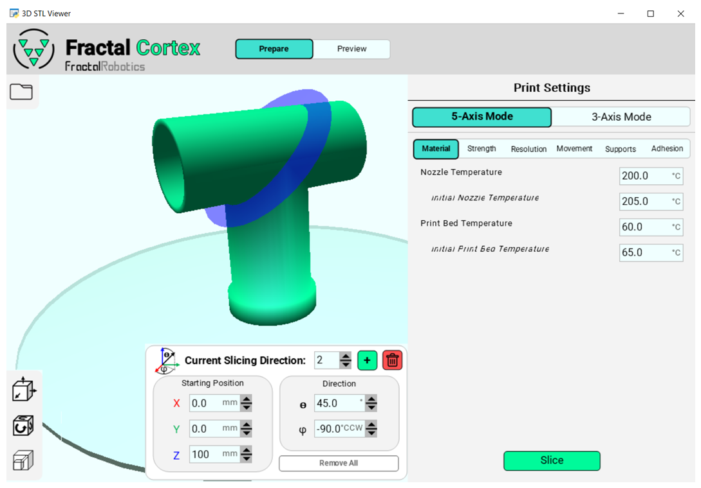
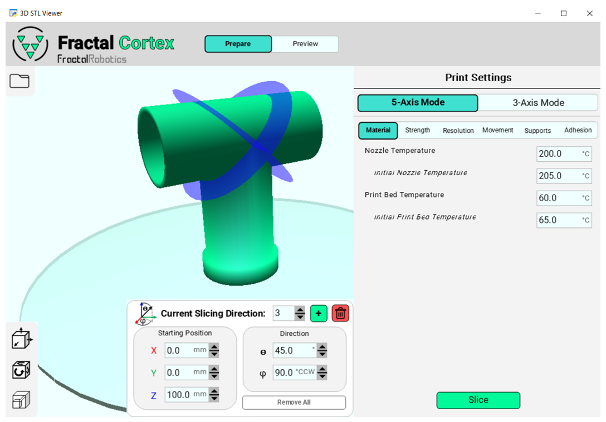
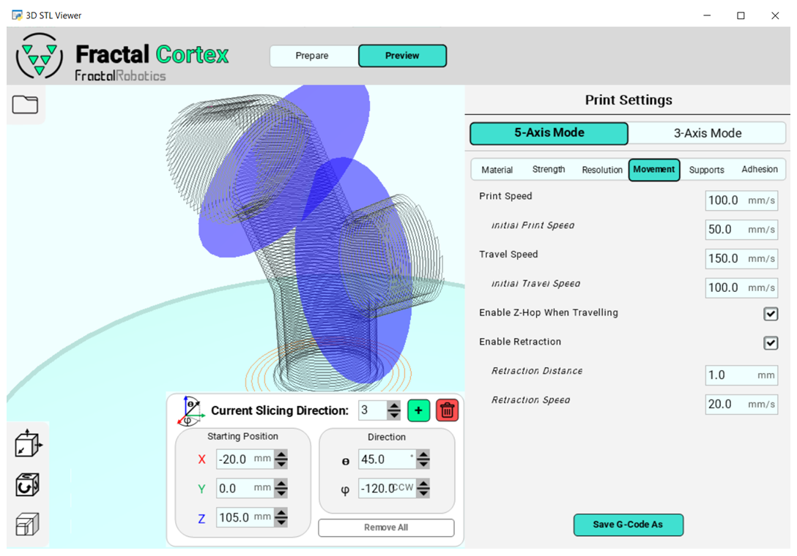
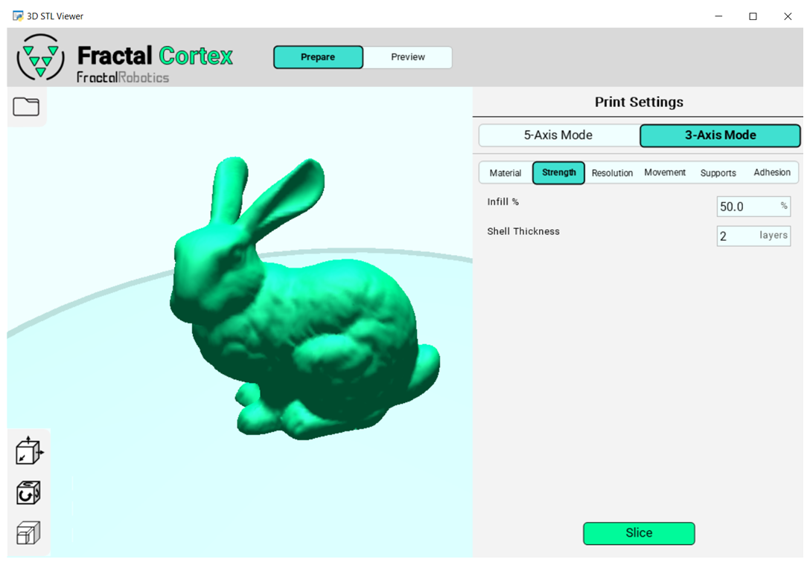
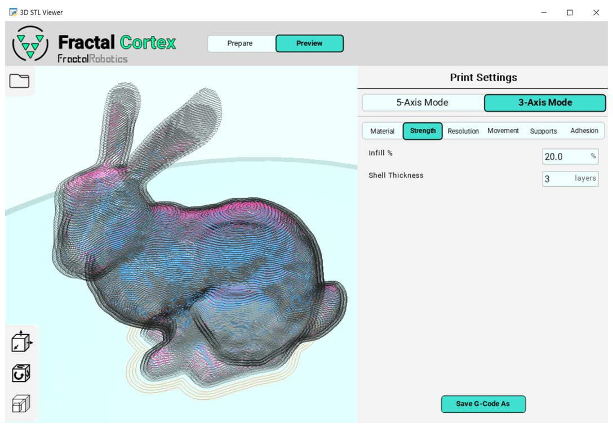

# Fractal Cortex

Fractal Cortex is an open source multidirectional 5-axis FDM slicer.

⚙️ A benchtop 5-axis 3D printer was developed to go along with this slicer. **You can check out the GitHub page for it here**.

  

# 💻System Requirements
- OS: Windows 10
- Python: 3.10.11
- Python Libraries:
  - glooey 0.3.6
  - numpy 1.26.4
  - numpy-stl 3.1.1
  - pyglet 1.5.28
  - pyOpenGL 3.1.0
  - shapely 2.0.4
  - trimesh 4.3.1

# 📘User Guide
Fractal Cortex is a multidirectional 5-axis FDM slicer that is backwards compatible with 3-axis slicing. To minimize the learning curve, many aspects of this slicer have been designed to feel familiar to the user experience of traditional 3-axis slicers. This overview will primarily cover the important differences that make Fractal Cortex unique.

**What is multidirectional 5-axis slicing?**

Multidirectional 5-axis slicing is a technique in which a 3D model is divided into sub-volumes (chunks) and each chunk is sliced in a different direction. This allows users to define multiple slicing directions for a given part. The result is a gcode file with toolpath instructions that include reorienting the part relative to the printhead. This approach is distinct from non-planar slicing, which modifies the surface of each layer to follow the curvature of the model's shape.

Non-planar slicing often requires significant training in advanced CAM software and tends to be computationally expensive. In contrast, multidirectional slicing provides many of the same benefits of 5-axis 3D printing - such as directional strength control and reduced support requirements - within a more accessable and familiar workflow. 

From a hardware standpoint, multidirectional 5-axis 3D printers avoid an important mechanical limitation of non-planar 5-axis 3D printers. Since they don't require the printhead to be long and thin to achieve tight angles, multidirectional printers can achieve much higher print speeds with far less vibration. That said, non-planar slicing is an exciting and evolving area of research, and ongoing developments will hopefully make that method more accessible as well.

**5-Axis Mode**

To slice a part (or multiple parts) in 5 axes, follow the instructions below:
1. Assuming you've downloaded the source code to your local computer, open Fractal Cortex by right clicking on "slicer_main.py". Select "Edit with IDLE" > "Edit with IDLE 3.10 (64 Bit)". Once the file is open, run it by pressing F5. The window shown below should appear. Notice that 5-Axis Mode is selected by default.

2. Select one or more STL files by clicking the folder icon in the upper left. The STL should become visible in the graphics window. If you need to translate, rotate, or scale the STL file(s) you may do so by left-clicking on the desired STL file (or holding CTRL to select multiple or CTRL+A to select all) and using the geometry action toolbar on the lower left corner of the graphics window. To undo an action, press CTRL+Z. These geometry manipulation tools are standard in most traditional slicers. 

3. Next, you can specify the starting number of slicing directions in the print settings on the right side of the screen. Notice that the lowest number you can select is 2, since the first slicing direction is always defined as the direction normal to the build plate. Having only 1 slicing direction would be the same as just slicing a part in 3 axes. Hit apply and you should see a blue plane and a new menu labelled "Current Slicing Direction" appear in the graphics window.

4. Adjust the position and orientation of the blue slice plane using the 5 entry boxes within the "Current Slicing Direction" menu.

5. You can add a new slice plane using the "+" button, remove a slice plane using the trash icon, or remove all slice planes to revert to the start of step 3.

   
6. Once you've defined all the slicing directions you want, you can cycle through the print settings on the right side of the screen to control many of the options that are standard in most traditional slicers, such as nozzle temperature, layer height, print speed, retraction, etc. Once you are content with your selection, hit the slice button. 

    **Note:** If Fractal Cortex detects that a slice plane will cause a collision between the ***nozzle and print bed***, it will halt slicing calculations and color the "illegal" slice plane red until you redefine it to a "legal" position and orientation. You do not have to worry about collisions between the ***nozzle and in-process part*** because the slicer orders slicing directions in a safe manner no matter how you define them. With the exception of potential centering calibration issues with the printer hardware, the slicer should never produce G-Code that results in any type of collision.

7. When slicing is finished, you can select the "Preview" button at the top of the screen to see a visualization of the 5-axis toolpath (The figure below has very thick layer lines to clearly show the multidirectional nature of the toolpaths). From here you can save a copy of the gcode file.

**3-Axis Mode**

To slice a part (or multiple parts) in 3 axes, follow the instructions below:
1. Open Fractal Cortex and select "3-Axis Mode" on the top right of the screen under print settings. You can select one or more STL files and define print settings like you normally would in a traditional 3-axis slicer.

2. After you hit slice, you can select the "Preview" button to see a visualization of the 3-axis toolpath. From here you can save a copy of the gcode file.

---

# Project Motivation
This project was motivated by the **Fractal Robotics** vision: **To accelerate the development of mechanical solutions.** In support of this vision, this project aims to address the gap between the limitations of 3-axis FDM and the inaccessibility of current 5-axis FDM.

**📋Limitations of 3-Axis FDM**
  - Part strength is limited due to the direction of printing
    - Parts often fail when forces are applied parallel to the direction of layer lines
    - Stacking layers in only one direction limits design freedom
  - Overhangs require support structures
    - The process of removing supports often damages or destroys a part
    - Support structures waste material

**🔒Inaccessibility of Existing 5-Axis FDM**
  - Options for existing 5-Axis slicer applications are limited
    - Most non-planar slicing requires significant training on advanced CAM softwares and are not compatible with all geometries
  - Commercially available 5-Axis 3D printers are huge and expensive

---

# Note From the Author to the Community
Hi, my name is Dan Brogan, and I spent 3 years (2022-2025) bootstrapping a startup called Fractal Robotics while working part time jobs. Over those 3 years, I developed technical acumen in end-to-end robotics product development, improved my communication skills, and learned a great deal about what goes into running a startup. 

My career goal has always been and continues to be **to contribute to society through technology in a way that has a positive impact**. That goal was translated into the vision of Fractal Robotics, which is "to accelerate the development of mechanical solutions".

At this point, I am unable to continue volunteering my full effort into this project. While I won't be stepping back entirely, I have decided the best path for this project is to release both the Fractal Cortex slicer and designs for the Fractal 5 Pro under an open source license so that others can learn from, build upon, and contribute to it. 

Open sourcing this project allows me to fulfill the original vision of Fractal Robotics. By sharing my work, I hope to support researchers, developers, educators, and makers exploring similar ideas.

I'm excited to see where others take this work next.

Feel free to [connect with me](https://www.linkedin.com/in/dan-brogan-442b27128/) on LinkedIn.

---

# 📝Future Work

While Fractal Cortex is functional as-is, there are some known issues that need to be addressed to make it a more robust product.

- Sometimes slicing calculations will encounter challenging geometry that halts the slicing process. This is the most important issue and requires more in-depth error handling within slicing_functions.py.
- Improve efficiency of slicing calculations (I parallelized everything I could, but there's room for improvement)
- Add support generation for both 3 and 5-axis modes
- Add more advanced print settings

---

# Acknowledgements

- Family & friends
- Innovate Newport
- RISBDC
- RIHUB
- Rhode Island startup community